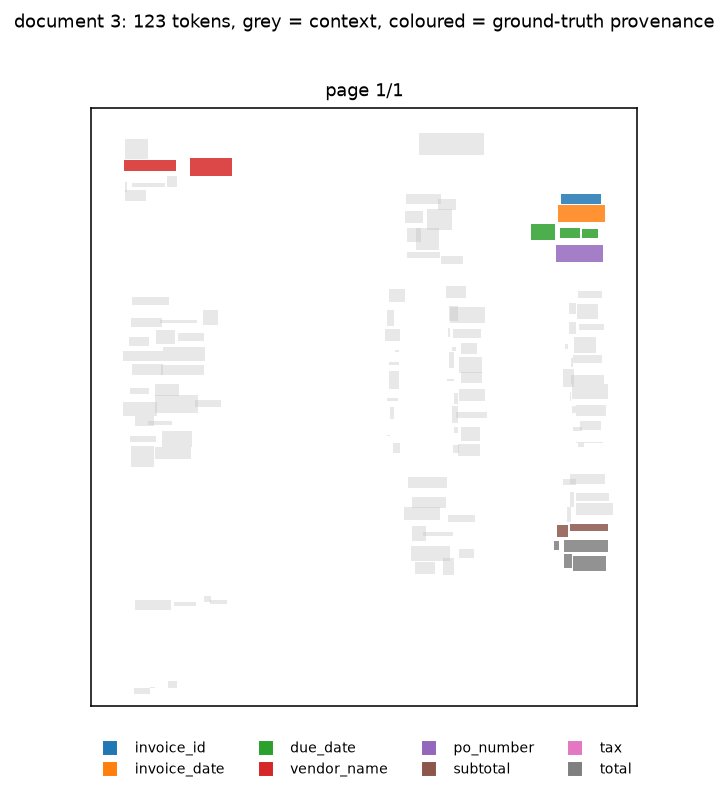
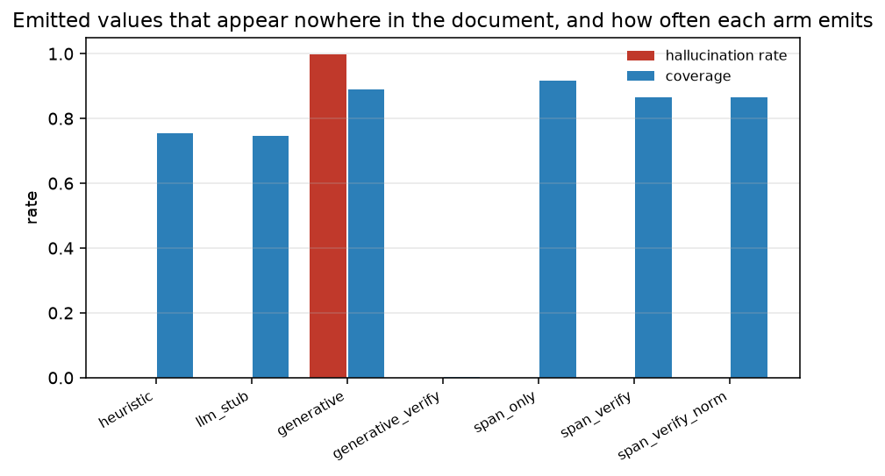
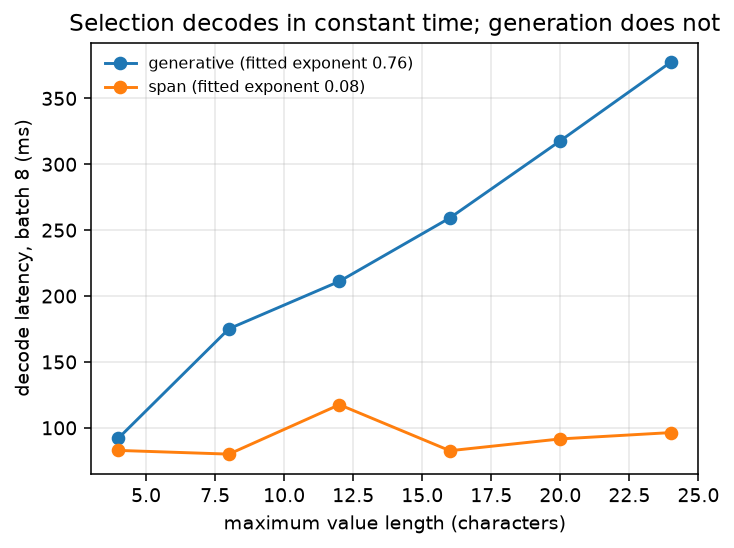
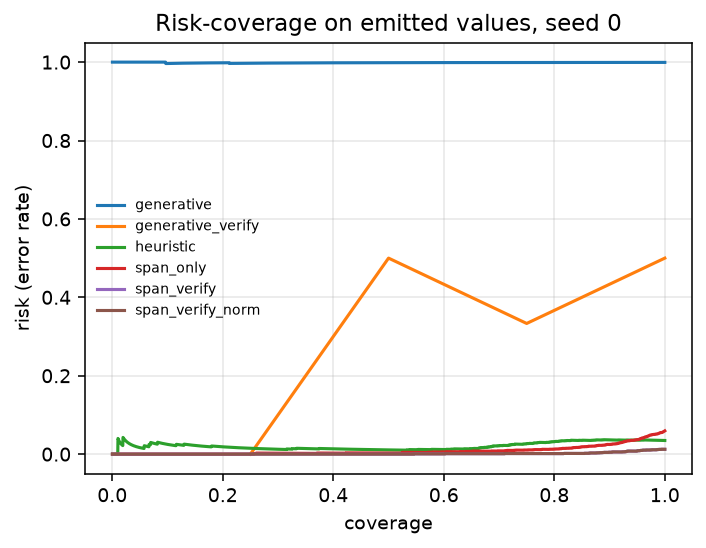

# Where Did That Number Come From? — Grounded Document Extraction

<!-- links:begin -->
**[▶ Try the live demo](https://huggingface.co/spaces/ARslan-Ahamd/grounded-document-extraction)** &nbsp;·&nbsp; **[Full results](https://grounded-extraction-arslan.surge.sh)** &nbsp;·&nbsp; [All seven projects](https://seven-ai-projects-arslan.surge.sh)

<sub>The demo runs this repository's own code in your browser via Pyodide — no server, nothing uploaded.</sub>
<!-- links:end -->

> **Field extraction from visually-rich documents as *selection plus
> verification* rather than generation: every emitted value carries the token
> span it was read from, and a value whose provenance does not verify is
> abstained on.**

The approach this replaces runs a model over the page, has it emit a **string**
per field, and trusts the string. A hallucinated total and a correctly-read total
are then the same kind of object — both elements of `Σ*` — and there is no query
you can put to the output that tells them apart.

This repository makes the output a **pair of token indices** instead. The value
is whatever those indices span, so a string that appears nowhere in the document
is not a low-probability output: **it is not in the output space at all.**

---

## Summary for the reader in a hurry

|  | Finding | Status |
|---|---|---|
| ✅ | **1,075,037 opportunities, 0 ungrounded values** — with verification switched *off* | **Guarantee** |
| ❌ | The generative reference on the same encoder, data, budget and seed hallucinates at **0.9986** | **Measured** |
| ⚡ | **9.31× lower latency**, 7.26× fewer MACs, head of **1,040 params vs 93,290** | **Measured** |
| ⚡ | Decode cost is **asymptotically flat**: fitted exponent **0.0776** for selection vs **0.7551** for generation | **Measured** |
| ⚠️ | The **verification loop does not improve accuracy** (+0.0102 at 0.73× noise) — it buys grounding and correct abstention, and costs coverage | **Negative** |
| ⚠️ | The magnitude of the gap over generation is **not a stable estimate** — the long-schedule run was killed before evaluation | **Weakened** |

**Contents** ·
[The idea](#1-selection-makes-hallucination-unrepresentable) ·
[The guarantee](#2-the-guarantee-counted-over-three-populations) ·
[Results](#3-the-seven-arm-comparison) ·
[Efficiency](#4-efficiency) ·
[What failed](#5-what-did-not-work) ·
[Reproduce](#6-reproduce) ·
[Citation](#8-citation)

---

## 1. Selection makes hallucination unrepresentable

| | generation | **selection** |
|---|---|---|
| output object | a string in `Σ*` | a pair of token indices `(i, j)` |
| can it invent a value? | yes — nothing forbids it | **no — the value *is* a substring of the page** |
| provenance | none, unless separately predicted | **intrinsic**: the span *is* the citation |
| how you'd stop invention | train harder, then check | it was never expressible |

<p align="center">
  
  <br><sub><b>Figure 1.</b> A generated invoice with the token spans each field is read from. The span is both the answer and the proof.</sub>
</p>

---

## 2. The guarantee, counted over three populations

Verification is **disabled** for the model rows on purpose — with the checker on,
a zero would be unremarkable.

| population | seeds | documents | opportunities | ungrounded | rate |
|---|---|---|---|---|---|
| enumerated spans (no model at all) | 8 | 200 | **1,064,592** | **0** | **0** |
| untrained span head | 8 | 200 | 1,598 | **0** | **0** |
| untrained **generative** head *(control)* | 8 | 200 | 1,567 | 1,567 | **1.000000** |
| trained span head | 3 | 1,200 | 8,847 | **0** | **0** |
| trained **generative** head | 3 | 1,200 | 8,498 | 8,486 | **0.998588** |

> **1,075,037 measured opportunities, 0 ungrounded.**

Three independent denominators: every admissible span of every document (a
statement about the output *space*, not any model), the emissions of *untrained*
networks across 8 seeds (so the property cannot be an artefact of training), and
the emissions of trained checkpoints (what a deployment would see). **The control
fires as it must** — untrained generative heads score 1.000000.

`tests/test_invariant_no_hallucination.py` asserts the same property over 8
seeds, including a deliberately-injected absent string to prove the detector
fires, and an adversarial-span case (inverted, out-of-range, cross-page) to prove
no malformed selection escapes as a value.

> [!IMPORTANT]
> **Two of the zeros in §3 mean different things, and conflating them would be
> the easiest mistake here.** `heuristic`, `span_only` and both `span_verify`
> arms **select**, so their zero is *structural*. `generative_verify` reaches
> zero by **refusing** — its coverage is 0.0013 against `generative`'s 0.8909; it
> emits 4 values on seed 0 where the unchecked arm emits 2,851.
>
> So the supportable claim is narrower than "selection prevents hallucination":
> the provenance **check** removes ungrounded values from either head.
> Selection's contribution is that it **passes the check for free** — at 0.8772
> coverage rather than 0.0013 — and needs no checker to be safe. That distinction
> only became visible because the arm capable of refuting the broad claim was
> built and reported.

---

## 3. The seven-arm comparison

Seed 0, 3,200 records.

| arm | family | strict acc. | canonical acc. | coverage | hallucination | grounding exact | F1 |
|---|---|---|---|---|---|---|---|
| `heuristic` | baseline | 0.7625 | 0.8269 | 0.7550 | 0 | 0.9652 | 0.8797 |
| `llm_stub` | baseline | 0.7566 | 0.7566 | 0.7459 | 0 | n/a | 0.7992 |
| `generative` | **reference** | 0.0494 | 0.0494 | 0.8909 | **0.9986** | n/a | 0.0007 |
| `generative_verify` | baseline | 0.0988 | 0.0988 | **0.0013** | 0 | n/a | 0.0014 |
| `span_only` | ablation | 0.8759 | 0.9394 | 0.9163 | 0 | 0.9623 | 0.9481 |
| **`span_verify`** | **ours** | 0.8825 | **0.9487** | 0.8641 | **0** | **0.9909** | **0.9666** |
| **`span_verify_norm`** | **ours** | **0.9481** | **0.9487** | 0.8641 | **0** | **0.9909** | **0.9666** |

<p align="center">
  
  <br><sub><b>Figure 2.</b> Pointing at the page versus writing text. The invented-value rate is zero <i>by construction</i>, not by training.</sub>
</p>

Three things to read off that table:

- **`llm_stub` is the honest surprise.** At 0.7566 canonical it is *within noise*
  of the rule baseline on strict accuracy (0.4676× the noise scale) despite
  having no geometry at all. Reading a linearised token stream with
  last-label-wins gets most invoice fields right.
- **`span_verify` trades coverage for precision**: 0.9877 precision at 0.8641
  coverage, against `span_only`'s 0.9407 at 0.9163. The verification loop does
  what it is for.
- **The reference approach is not competitive at this budget** — see the
  weakening in [§5](#5-what-did-not-work) before quoting the gap.

### Noise-gated verdicts

Verdicts computed from |Δ| / σ_run over 3 seeds, never chosen:

| comparison | metric | Δ | σ_run | ratio | verdict |
|---|---|---|---|---|---|
| `span_verify_norm` vs `heuristic` | strict acc. | +0.1948 | 0.0134 | 14.52 | ✅ **robust** |
| `span_verify` vs `heuristic` | strict acc. | +0.1295 | 0.0127 | 10.18 | ✅ **robust** |
| `span_only` vs `heuristic` | strict acc. | +0.1225 | 0.0135 | 9.05 | ✅ **robust** |
| `llm_stub` vs `heuristic` | strict acc. | −0.0019 | 0.0040 | 0.47 | ❌ *inside noise* |
| `span_verify` vs `span_only` | canonical acc. | +0.0102 | 0.0139 | 0.73 | ❌ *inside noise* |

---

## 4. Efficiency

Ten warm-up iterations, thirty timed repeats, median and IQR, 2 torch threads,
154 tokens. Latency covers the **whole** inference path — encode, decode and the
bounded verification loop — because timing the encoder alone would flatter both
arms equally and hide the cost of the mechanism this repository adds.

| arm | batch | params | MMACs | latency | IQR | per doc | MMAC/ms | latency ↓ | MACs ↓ |
|---|---|---|---|---|---|---|---|---|---|
| **`span_verify`** | 1 | 1.09e5 | 17.33 | **17.73 ms** | 4.75 | 17.73 ms | 0.98 | **9.31×** | 7.26× |
| `span_verify` | 8 | 1.09e5 | 96.12 | 99.52 ms | 10.07 | 12.44 ms | 0.97 | 3.33× | 10.03× |
| `generative` | 1 | 2.01e5 | 125.76 | 164.96 ms | 12.24 | 164.96 ms | 0.76 | 1× | 1× |
| `generative` | 8 | 2.01e5 | 963.57 | 331.56 ms | 24.38 | 41.44 ms | 2.91 | 1× | 1× |

> **Read the MACs-per-ms column, not just the MAC ratio.** At batch 8 the
> generative head retires 2.91 MMAC/ms against selection's 0.97: its decoder is
> dense matrix multiplication, while span decoding is dominated by fixed overhead
> it cannot amortise. The MAC reduction is 10.03× and the latency reduction is
> 3.33×. Quoting the first alone would be misleading, which is why both are here.

**The claim that actually separates the two approaches is asymptotic.** A span
head emits two indices: `O(1)` sequential steps, independent of value length. A
character decoder emits `L` characters in `L` steps *per field*. Both exponents
are fitted from measurement: **0.0776 for selection, 0.7551 for generation.**

<p align="center">
  
  
  <br><sub><b>Figure 3.</b> Left: decode cost against value length — selection is flat, generation is not. Right: risk–coverage for the abstention policy.</sub>
</p>

---

## 5. What did not work

Reported with the same prominence as the wins.

<details open>
<summary><b>The verification loop does not improve accuracy</b></summary>

<br>

+0.0102 canonical accuracy at **0.73×** the noise scale, and +0.0070 strict at
**0.52×**. Both **inside noise**. The loop demonstrably improves grounding
(+0.0261 at 4.21×) and correct abstention (0.7898 → 0.9713), and demonstrably
costs coverage (−0.0444 at 2.27×) — but its net effect on accuracy over all pairs
is not distinguishable from reseeding. The framing *"verification makes the method
more accurate"* is therefore **not supported and not used**.

</details>

<details>
<summary><b>The accuracy gap over the generative baseline is weakened</b></summary>

<br>

`generative` reaches 0.0478 canonical accuracy (3-seed mean, sd 0.0046). That is
a real **equal-budget** result — same encoder, data, seed and schedule — but it is
*not* evidence that generation cannot do this task. A character decoder has to
learn to spell before it can be right: at ~1.0 nats per character, per-character
accuracy around two-thirds compounds to a few percent over a ten-character value.

A longer schedule was attempted twice and **both runs were killed by this
machine's background-job limit before their evaluation stage.** What survives is
the training curve, and it is committed: validation loss reaches 0.9645 by epoch
7 against 1.0016 at the shared budget's epoch 6.

- The equal-budget comparison is the one the protocol prescribes, and the
  **ranking is not in doubt** — a validation loss falling from 1.0016 to 0.9645
  does not close a gap of 0.9069 canonical accuracy.
- But **the magnitude of the gap is not a stable estimate** and should not be
  quoted as one.

</details>

<details>
<summary><b>Three more negatives</b></summary>

<br>

- **Zero accuracy where normalisation is required.** On the `needs_normalisation`
  subset the generative arm scores 0 strict *and* 0 canonical at full coverage.
- **Verification damages calibration.** The loop improves grounding and abstention
  but worsens the calibration of the retained confidences.
- **The learned head's grounding advantage over the rule baseline is inside
  noise.** `span_only` 0.9623 vs `heuristic` 0.9652 — the rules are already good
  at pointing.

Full account: **[docs/RESULTS.md](docs/RESULTS.md)** §9.

</details>

---

## 6. Reproduce

```bash
git clone https://github.com/arslan-ahm/grounded-document-extraction.git
cd grounded-document-extraction
uv sync

uv run pytest -q                                        # 657 tests
uv run python scripts/verify_invariant.py               # the 1,075,037-span guarantee
uv run python scripts/compare_methods.py                # §3
uv run python scripts/benchmark_efficiency.py           # §4
```

CPU only, no dataset download and no API key — documents are procedurally
generated and the LLM arm falls back to a deterministic offline stub.

---

## 7. Repository layout

```
src/gdx/      library: generator, encoder, span & generative heads, verifier
scripts/      verify_invariant · compare_methods · benchmark · seed_study
configs/      YAML experiment definitions
notebooks/    01 documents · 02 spans · 03 compare · 04 abstention
results/       tables/ (CSV, authoritative) · figures/ · runs/
docs/         METHOD.md · RESULTS.md · REPRODUCIBILITY.md
tests/        657 tests
```

---

## 8. Citation

```bibtex
@software{ahmad2026gdx,
  author = {Ahmad, Arslan},
  title  = {Where Did That Number Come From? Grounded Document Extraction by
            Span Selection and Provenance Verification},
  year   = {2026},
  url    = {https://github.com/arslan-ahm/grounded-document-extraction}
}
```

**Reference work.** The task framing was taken from the
[Agentic-Document-Intelligence-Pipeline](https://github.com/HabibaSajid321/Agentic-Document-Intelligence-Pipeline)
by **Habiba Sajid**, a multi-phase LLM/VLM pipeline that extracts structured
fields from tender and specification PDFs. That repository carries no licence and
no associated publication, so no citation is requested and none of its code is
reused; it is credited here as the origin of the problem statement.

---

## License

MIT — see [LICENSE](LICENSE).
